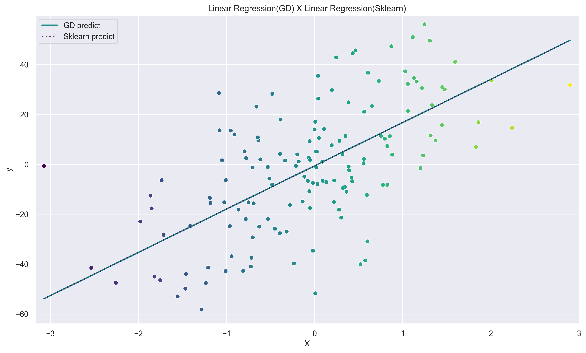
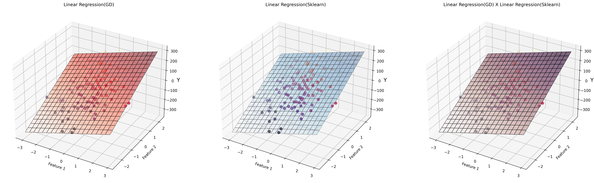
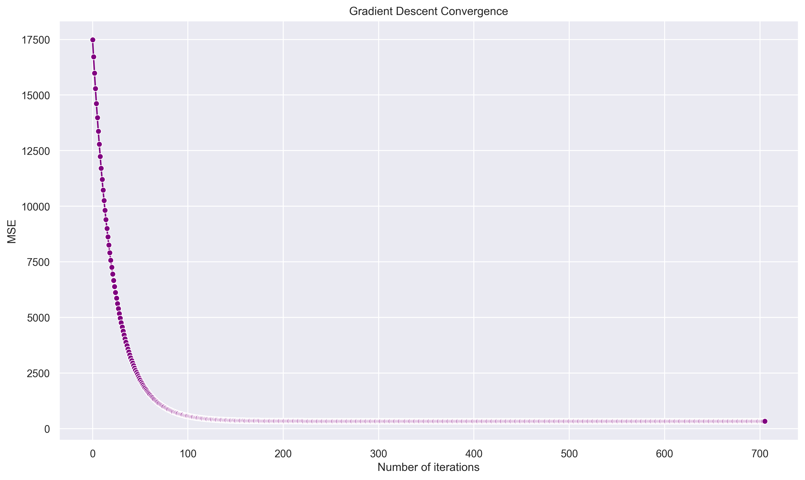

# Linear Regression from Scratch with Gradient Descent Optimization

## Overview
This project implements a Linear Regression model completely from scratch
using Batch Gradient Descent optimization. The goal is to deeply understand the
mathematical foundations of linear regression and verify the correctness
of the implementation by comparing it with Scikit-Learn's reference model.

---

## Key Concepts Covered
- Linear Regression hypothesis function
- Mean Squared Error (MSE) cost function
- Analytical gradient derivation
- Batch Gradient Descent optimization
- Convergence analysis
- Model validation using visual and numerical comparisons

---

## Mathematical Formulation

The hypothesis function is defined as:

$$
\hat{y} = Xw + b
$$

The optimization objective is to minimize the Mean Squared Error (MSE):

$$
J(w, b) = \frac{1}{n} \sum_{i=1}^{n} (y_i - \hat{y}_i)^2
$$

The parameters are updated using Batch Gradient Descent:

$$
w := w - \alpha \frac{\partial J}{\partial w}
$$

$$
b := b - \alpha \frac{\partial J}{\partial b}
$$

---

## Visual Results

### 2D Prediction Comparison
The 2D plot shows that the prediction lines produced by the custom
implementation and by Scikit-Learn's LinearRegression almost perfectly
overlap, indicating that both models learned the same linear function.

---

### 3D Regression Plane Comparison
The 3D visualization demonstrates that the regression plane learned by the
custom implementation nearly overlaps with the plane learned by
Scikit-Learn's model.

---

### Gradient Descent Convergence
The loss curve shows a smooth and stable decrease over iterations,
indicating proper convergence of the optimization algorithm.

---

## Quantitative Evaluation

The custom implementation was evaluated using standard regression metrics
(MSE, MAE, and R²) and compared against Scikit-Learn's LinearRegression.

The differences between the errors produced by both models are consistently
on the order of **10⁻⁴ or smaller**, confirming numerical equivalence up to
floating-point precision.

---

## Conclusion

This project demonstrates that a correctly implemented Gradient Descent
algorithm can successfully optimize a Linear Regression model and achieve
results equivalent to a well-established machine learning library.

The implementation provides a strong foundation for understanding more
advanced optimization techniques and linear models.
